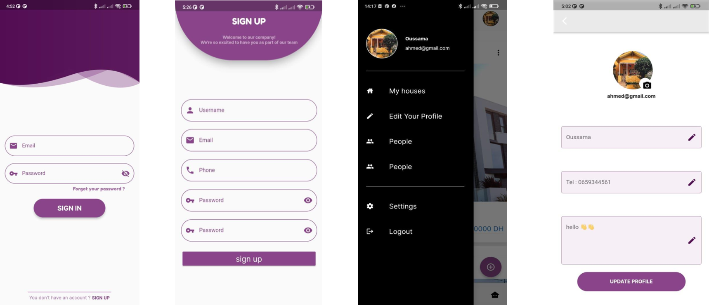
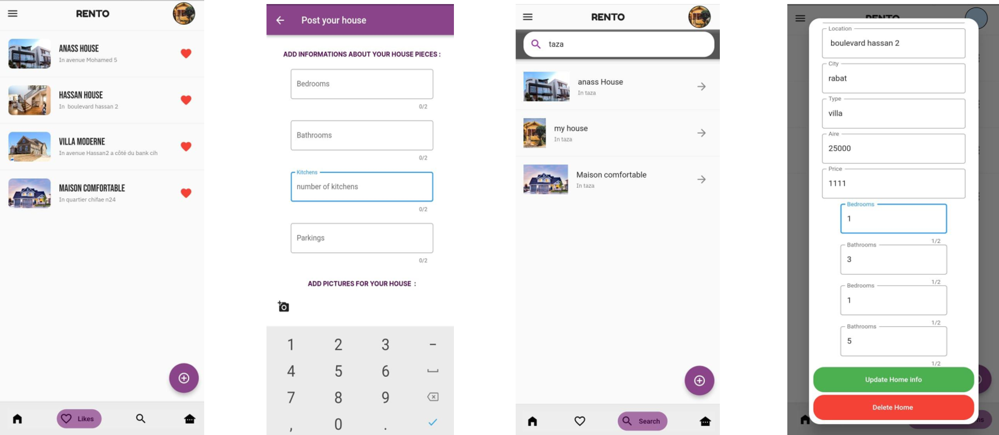
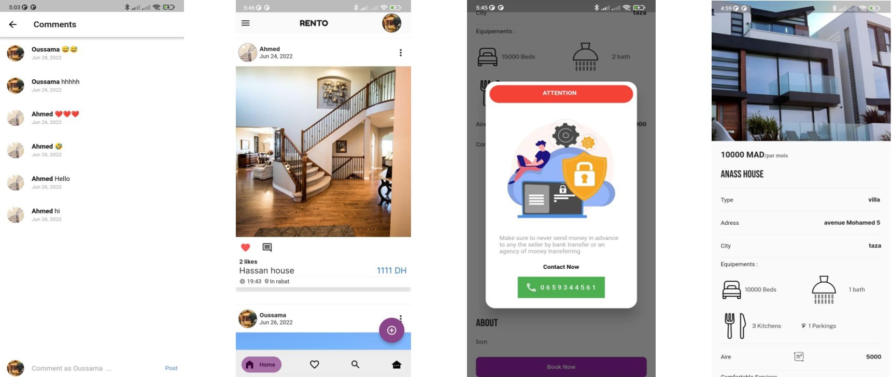

# Rento - Cross-Platform Rental Application
Rento is a cross-platform mobile application designed to facilitate seasonal property rentals. The app allows property owners to list their homes, villas, apartments, or other types of accommodations, and provides users with a convenient way to search, view, and book properties. Built using Flutter, Rento offers a seamless experience on both Android and iOS devices.

# Project Overview
This project was developed as part of the Final Year Project for the completion of a bachelor's degree in Mathematics and Computer Science. The goal was to automate and improve the rental process by providing an easy-to-use platform for both property owners and tenants.

# Key Features

* **User Authentication**: Users can sign up, log in, and manage their profiles.
* **Property Listings**: Property owners can add, modify, and delete listings.
* **Property Search**: Users can search for properties by location and various filters (number of rooms, property type, etc.).
* **Favorites and Comments**: Users can "like" properties to add them to their favorites and leave comments on listings.
* **Real-time Communication**: The app allows direct communication between renters and property owners for booking requests.

# Technologies Used
## Frontend
* **Flutter**: A cross-platform framework for building mobile applications on Android and iOS with a single codebase.
* **Dart**: The programming language used to build the Flutter app.

   

## Backend and Database
* **Firebase Authentication**: Handles user authentication securely.
* **Firebase Firestore**: A NoSQL cloud database used to store property listings, user data, and interactions.

 

## Development Tools
* **Visual Studio Code**: The primary development environment.
* **StarUML**: Used for designing the UML diagrams and modeling the application structure.

# Application Design
## UML Diagrams
* **Use Case Diagrams**: Define the interactions between the users (property owners, clients) and the system.
* **Sequence Diagrams**: Model the interactions between objects within specific processes like user registration and property publication.
* **Activity Diagrams**: Illustrate the flow of actions for tasks such as adding a property or managing listings.
* **Class Diagrams**: Outline the structure and relationships between objects within the system.
## User Interfaces
Rento’s user-friendly interface includes:

* **Splash Screen**: Initial screen with options for login or sign-up.
* **Login/Signup Pages**: Secure access to the app.
* **Home Page**: Displays all property listings with options to like, comment, or view details.
* **Property Detail Page**: Provides in-depth information about each listing.
* **Favorites Page**: Allows users to view their liked properties.
* **Search Page**: Helps users find properties based on location and preferences.
* **Owner Dashboard**: Allows property owners to manage their listings.
* **User Profile**: Lets users update their personal information.

## Overview of resulting UI

   

 

   

 

   

# Installation
## Prerequisites

* **Flutter SDK**: Make sure to install the Flutter SDK by following the official Flutter installation guide. [Flutter documentation setup](https://docs.flutter.dev/get-started/install)

* **Firebase Setup**: Set up a Firebase project for authentication and Firestore database by following. [Firebase intallation setup](https://firebase.google.com/docs/android/setup)

# Future Improvements
* **Transaction Module**: Add a secure payment system to handle online transactions between renters and property owners.
* **Web Version**: Develop a web version of the app using Flutter Web.
* **Improved Search Filters**: Include more advanced filtering options such as price range, property features, and availability.
# Conclusion
Rento simplifies the process of renting properties by providing a modern, cross-platform solution for both property owners and clients. The project has helped gain valuable experience in mobile app development, cross-platform frameworks, and real-time cloud databases. Future developments could enhance the app by integrating secure payment systems and expanding its functionality to the web.

